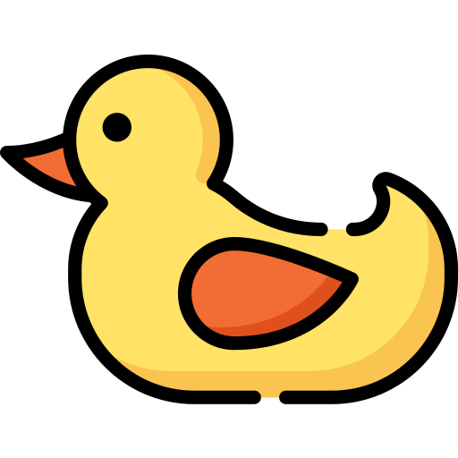

# Quack Chat

Quack Chat is a real-time chat application where users can connect with friends and start conversations. It provides a simple and intuitive interface for seamless communication.

## Features

- Real-time messaging: Chat with friends in real-time.
- Authentication: Sign in to join the conversation.
- Message history: View and scroll through past messages.
- Responsive design: Enjoy a seamless experience across different devices.
- User-friendly interface: Easy-to-use and intuitive chat interface.

## Technologies Used

- React: JavaScript library for building user interfaces.
- Firebase: Backend-as-a-Service (BaaS) platform for building web and mobile apps.

## Getting Started

To run the Quack Chat application locally, follow these steps:

1. Clone the repository: `git clone https://github.com/your-username/quack-chat.git`
2. Install the dependencies: `npm install`
3. Create a Firebase project and obtain the necessary configuration details.
4. Update the `firebase.js` file with your Firebase configuration.
5. Start the development server: `npm start`
6. Open the application in your browser: `http://localhost:3000`

## Folder Structure

- `src`: Contains the application source code.
  - `components`: Contains React components.
  - `assets`: Contains static assets such as images and styles.
  - `firebase.js`: Firebase configuration file.
  - `App.js`: Main application component.
  - `index.js`: Entry point of the application.

## Screenshots

 

 

<h5>Demo</h5>

 

## Deployment

To deploy the Quack Chat application to a live environment, you can use various hosting platforms such as Netlify, Vercel, or Firebase Hosting. Follow the deployment instructions provided by your chosen platform to publish the application.

## Contributing

Contributions to Quack Chat are welcome! If you encounter any bugs, have suggestions for improvements, or would like to add new features, feel free to open an issue or submit a pull request.

Please make sure to follow the existing code style and guidelines when contributing.

## License

This project is licensed under the [MIT License](LICENSE).

---

Enjoy chatting with your friends on Quack Chat! 🦆💬
